# rtsp-samsung-tv
## Description
Display  RTSP streams from IP Cameras on Samsung smart TV (Tizen TV)


[](https://badge.fury.io/js/rtsp-samsung-tv)  
  
[<span style="font-family:Verdana,Arial,sans-serif!important;font-weight:bold!important;font-size:14px!important;color:#2094de!important;line-height:18px!important;vertical-align:middle!important;">Donate</span>](https://secure.wayforpay.com/button/bf5d6c136e034)  

# Features
 - support more than 999 RTSP streams.  
 - switch channels(rtsp stream) using numpad on the remote control  
 - use server to convert rtsp streams using ffmpeg  
 - [group rtsp streams on the obe channel (Display 4 cameras streams on one channel)](#add-4-cameras-on-one-screen---)  
 - support udp and tcp transport  
 - tizen samsung tv application  
 - [admin ui](#admin-ui)  
 - [protect admin ui(optional)](#protect-admin-ui-using-keycloak-sso-optional)  
 - [Voice Control](#voice-control)  
 - [Remote Control](#remote-control)  
 -  Supports parameters before "-i" and after it  
 - [Raspberry Pi Hw acceleration](#raspberry-pi-hw-acceleration-on-ffmpeg-raspbian-lite-image)  


, ,   

# Please [Donate](https://secure.wayforpay.com/button/bf5d6c136e034)  
 Donations helps developing and maintain the project.  
 Donation Link: (https://secure.wayforpay.com/button/bf5d6c136e034)[https://secure.wayforpay.com/button/bf5d6c136e034]  

# Server Installation  
```bash
sudo apt-get install ffmpeg
wget -qO- https://getpm2.com/install.sh | bash
sudo env PATH=$PATH:/usr/bin pm2 startup systemd -u ${currentUser} --hp ${HOME}
sudo npm i rtsp-samsung-tv -g
sudo pm2 start `npm root -g`/rtsp-samsung-tv/server.js
sudo pm2 save
```
open ```http:\\<SERVER_IP>:3004``` and add a new  Camera and click Save 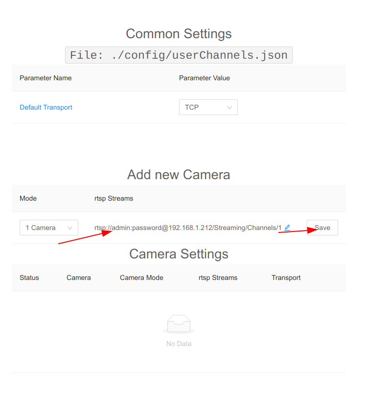 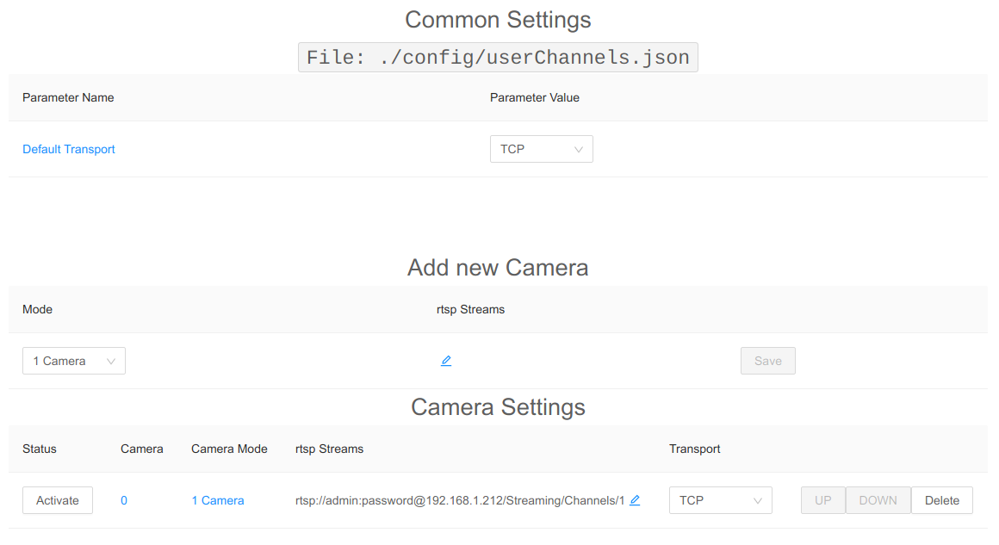

# Install Samsung TV Application(Tizen Application)  

1. install java jdk  
2. install Tizen SDK on your PC [https://developer.tizen.org/development/tizen-studio/download](https://developer.tizen.org/development/tizen-studio/download)  
3. download application source ```git clone https://github.com/vzakharchenko/rtsp-samsung-tv.git```  
4. in "Tizen Studio Package manager" install  "Tizen SDK Tools" 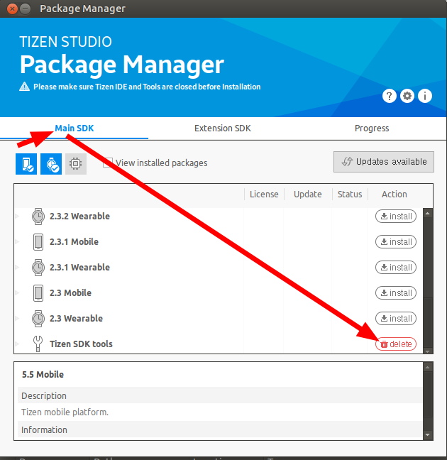  
5. "Extension SDK" install "extras" 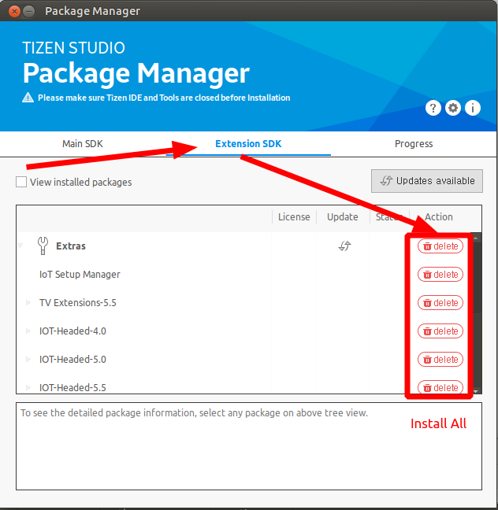  
6. open "Tizen Studio"  
7. File -> Open Project From File System 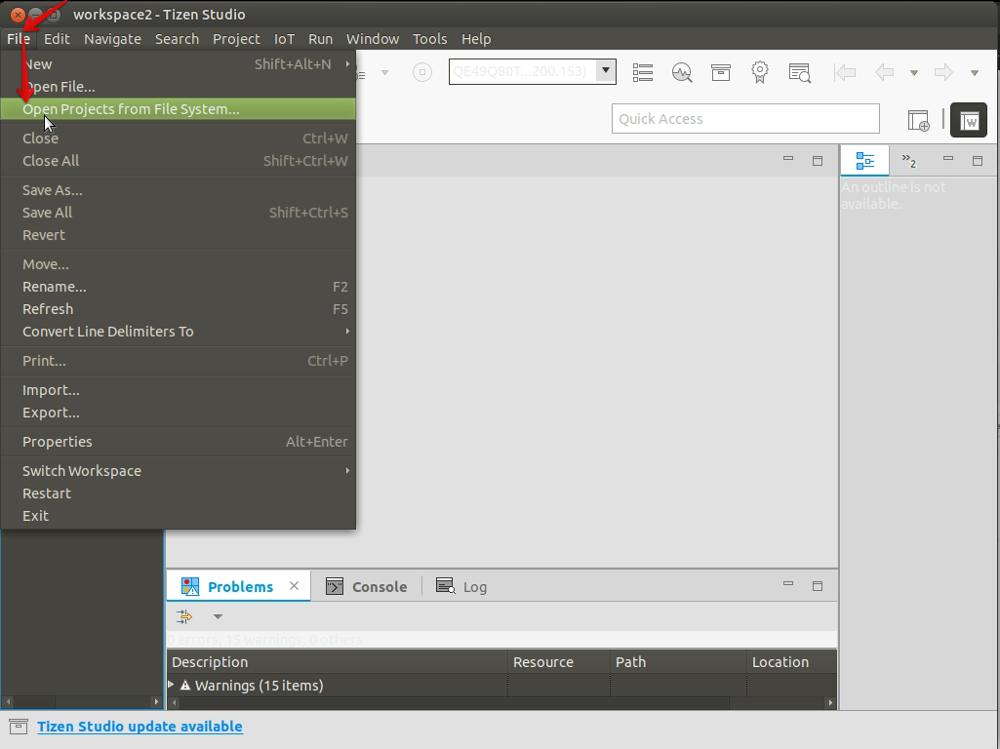  
8. open rtsp-samsung-tv/CameraDevice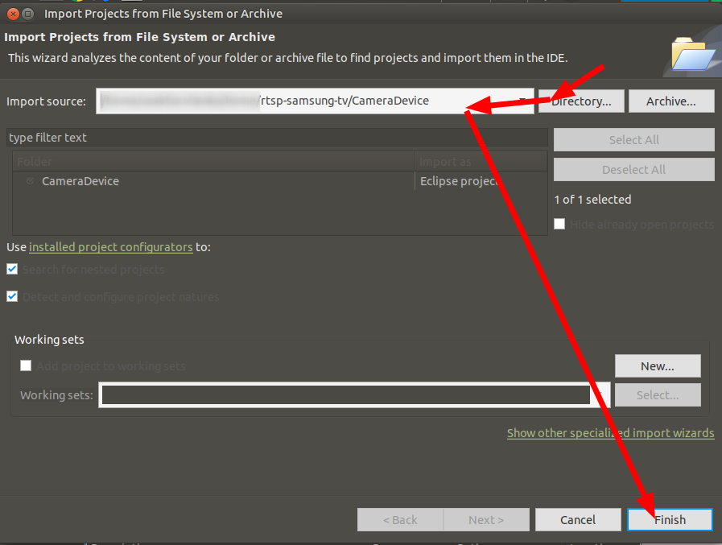  
9. [Enable Development mode on your TV](https://developer.samsung.com/smarttv/develop/getting-started/using-sdk/tv-device.html)  
10. open Device manager 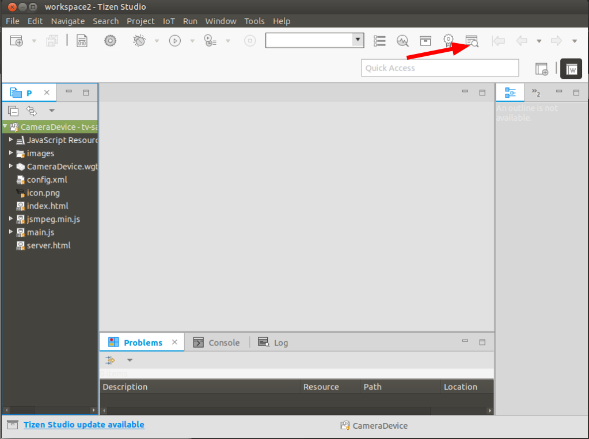  
11. click "Scan device" 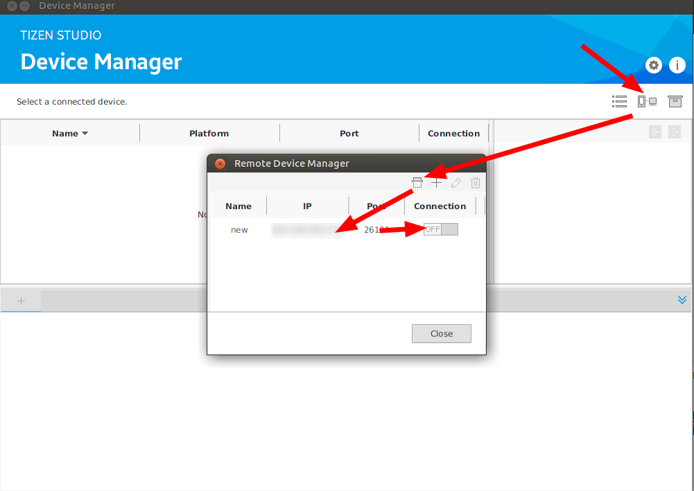  
12. set Connection to "On"  
13. right click on your connection and select "Permit install"   
  - If you see NO DUID For Selected Device  
  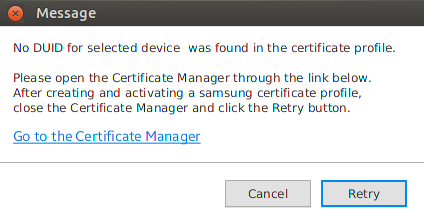  
    then you need to [generate certificate](#generate-samsung-certificate) for your TV  
14. in Tizen studio select project and run it on TV.Channel  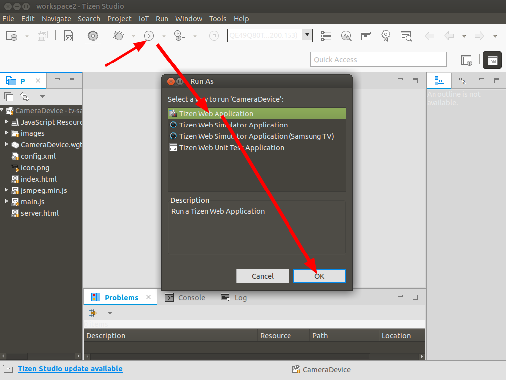  
15. setup server ip and port on TV.   


# Admin UI
## **Url**:  ```http:\\<SERVER_IP>:3004```  
  

where:  
**File** -  path to config file.  
**Default Transport** - Default RTSP Transport. Applicable to all cameras  
**Default RTSP FFmpeg parameters** - Parameters before "-i". Applicable to all cameras  
**Default Encode FFmpeg parameters** - Parameters before "-i". Applicable to all cameras  
```
ffmpeg <Default RTSP FFmpeg parameters> -i rtsp://stream <Default Encode FFmpeg parameters>
```

## Camera Specific Columns:  
**Status** - now on TV.  
**Camera** - channel number.  
**Camera Mode** - "1 Camera" : one camera on screen, "4 Cameras" : 4 cameras on one screen.  
**rtsp Streams** - rtsp streams.  
**Transport** - Camera RTSP Transport.  
**RTSP FFmpeg parameters** - Parameters before "-i". Applicable to all cameras  
**Encode FFmpeg parameters** - Parameters after "-i". Applicable to all cameras  
```
ffmpeg <RTSP FFmpeg parameters> -i rtsp://stream <Encode FFmpeg parameters>
```
  
## **add 1 Camera**:     
## **Add 4 cameras on one screen**: 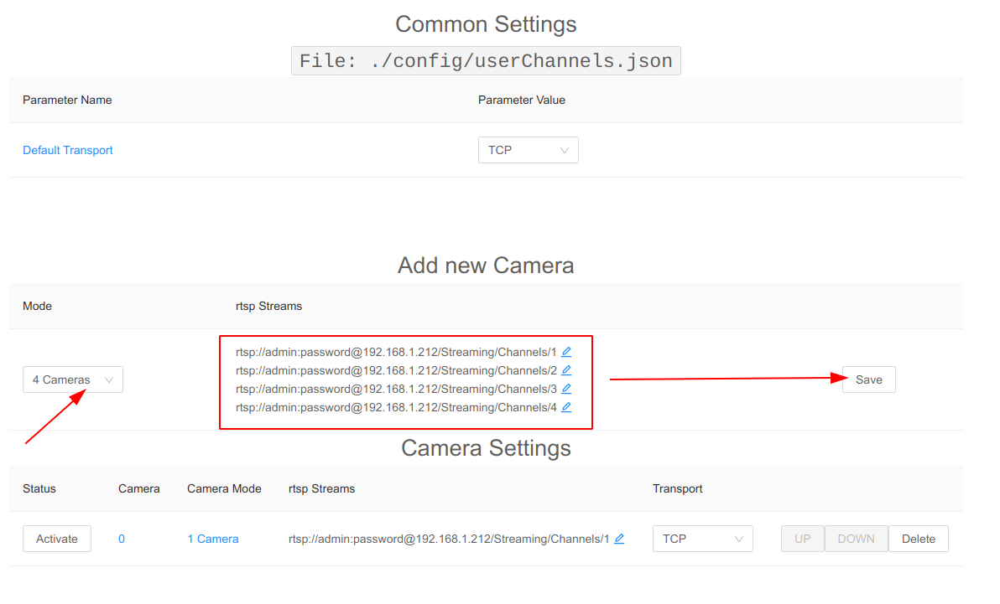 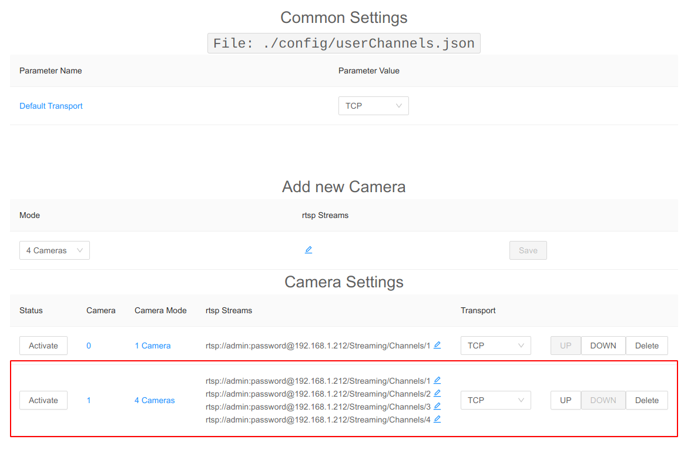   
## **delete Camera** 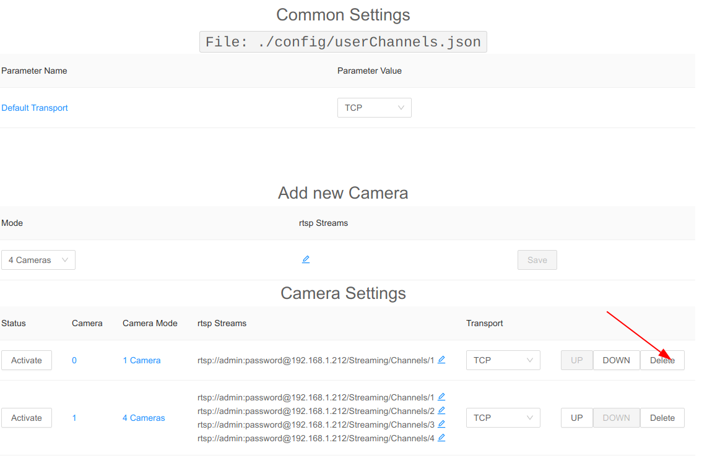  

# Protect Admin UI using keycloak SSO (Optional)  
1. download keycloak.json from the keycloak admin ui.  
2. save keycloak.json to [./config/keycloak.json](/config) or /opt/config  

example of keycloak.json  
```json
{
  "realm": "RTSP",
  "auth-server-url": "https://localhost:8090/auth",
  "ssl-required": "external",
  "resource": "testClient",
  "credentials": {
    "secret": "secret"
  },
  "confidential-port": 0
}
```  
# Raspberry Pi Hw acceleration on ffmpeg ([Raspbian Lite Image](https://www.raspberrypi.org/downloads/raspberry-pi-os/))  
1. build ffmpeg with mmal feature  
```bash
sudo apt-get install libomxil-bellagio-dev
sudo apt-get install libomxil-bellagio-bin
git clone https://github.com/FFmpeg/FFmpeg
cd FFmpeg
git checkout origin/release/3.2
sudo ./configure --arch=armel --target-os=linux --enable-gpl --enable-mmal  --enable-omx --enable-omx-rpi --enable-nonfree
sudo make -j4
sudo make install
```  
2.   
3. increase the GPU memory?  
  - ```bash
    sudo raspi-config
    ```
  -  **7 Advanced Options**   
  -  **A3 Memory Split**   
  - set value **256** or more   

# Voice Control  
    1. Press VOICE button  
    2. Say command  
 **List of commands:**  
 "Channel Up" (or the same on your language)  
 "Channel Down" (or the same on your language)    
 "1","2","3","4" ... "999"  

# Remote Control

  

# Generate Samsung Certificate

1. Open "Certificate Manager" 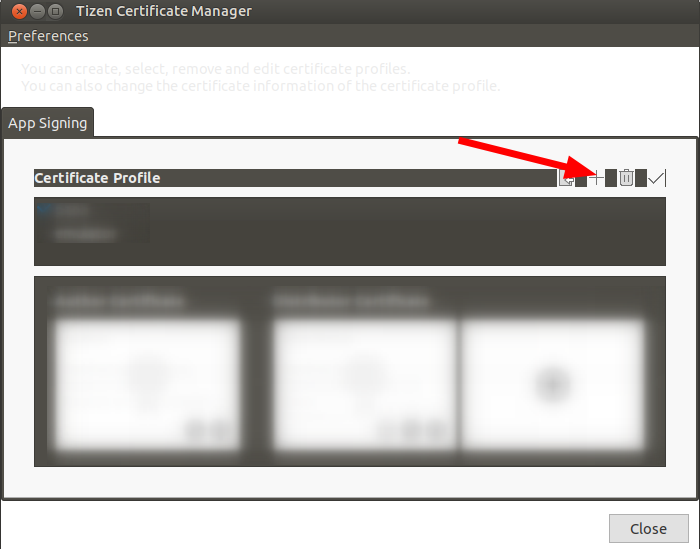
2. Add a new Samsung Certificate  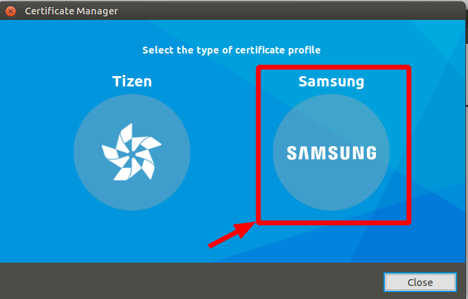 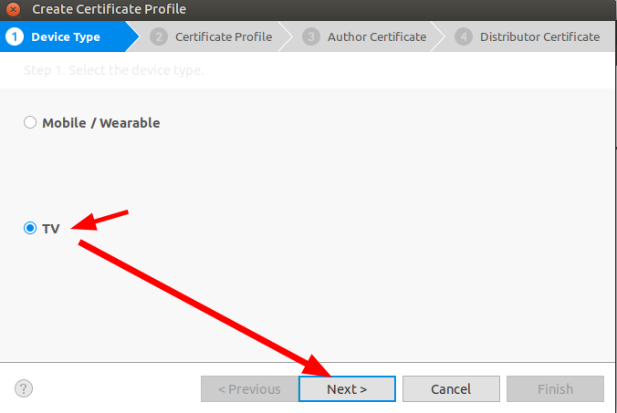
3. Select DeviceType "TV" 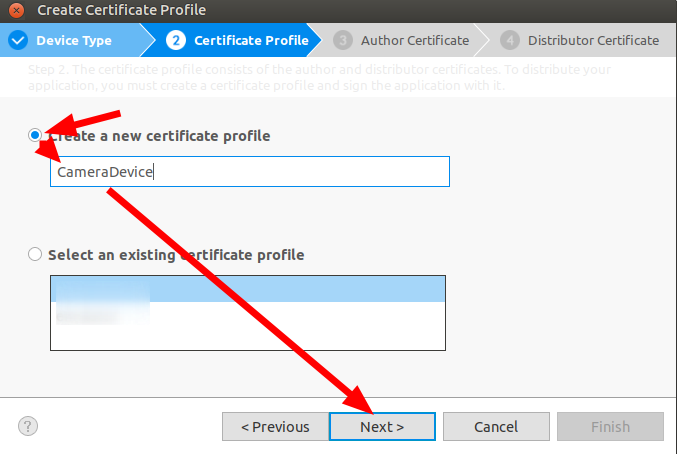
4. Click Next 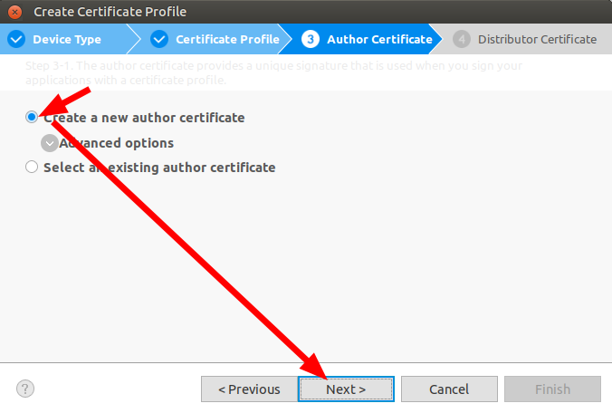
4. Type any name and password 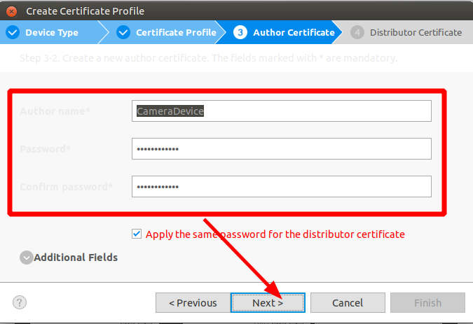
5. Click Ok 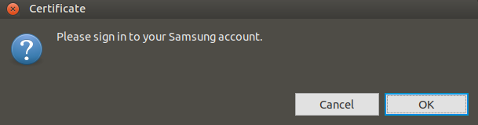
6. Login to Samsung Account 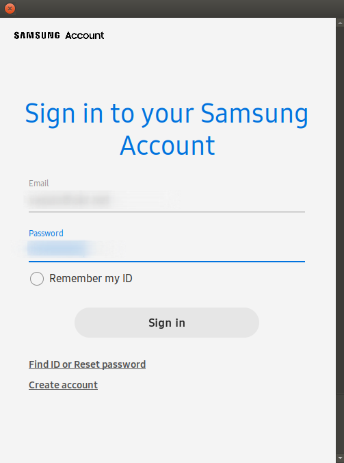
7. Next 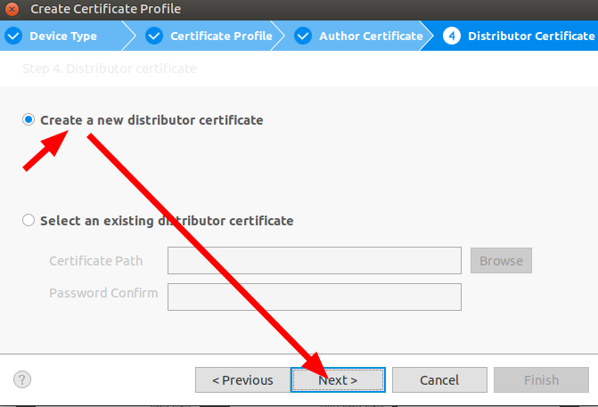
8. Add [Individual DUID](#individual-duid) 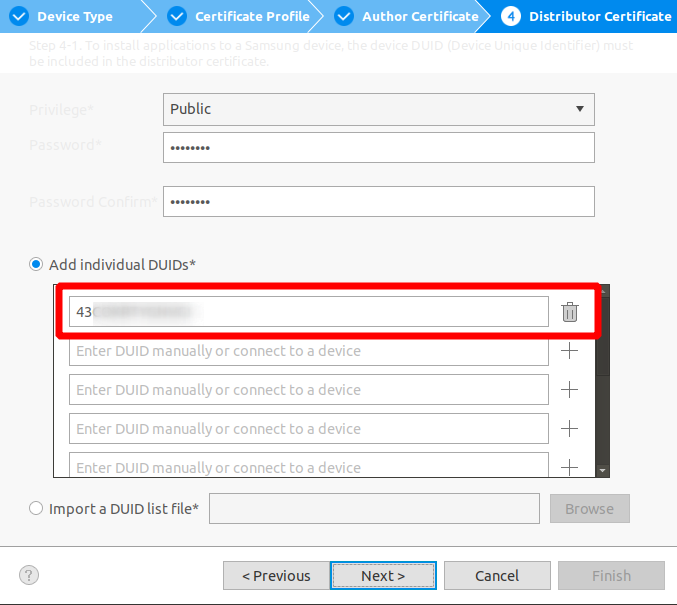  
9. Finish

#  Individual DUID
 On TV select "Settings"->"Support"->"About TV"-> Information About Smart Hub-> Unique Device Id 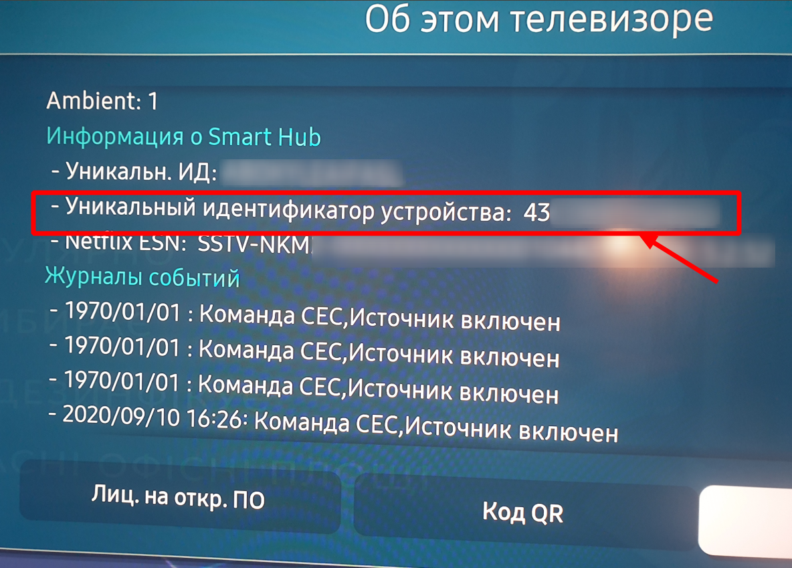  


# If you find these useful, please [Donate](https://secure.wayforpay.com/button/bf5d6c136e034)!    
